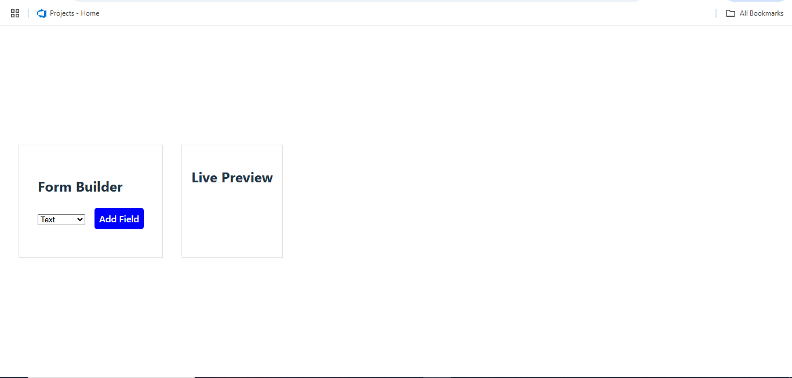
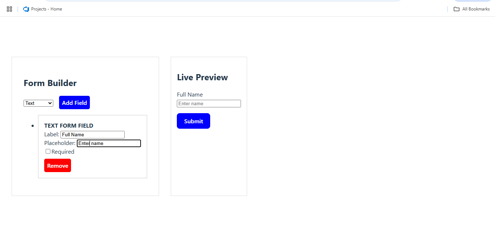

# Dynamic Form Builder with Live Preview (React + Redux Toolkit + TypeScript)

This is a dynamic form builder where users can add, configure, and preview different input fields in real-time. It is built with **React**, **Redux Toolkit**, and **TypeScript** to ensure robust state management and type safety.

## Demo

## Features

- Add form fields:
- Text Input
- Number Input
- Checkbox
- Radio Buttons (with custom options)
- Edit field properties:
- Label
- Placeholder
- Required toggle
- Reorder or remove fields
- Live Preview Panel (instant updates as fields are added or edited)
- Form submission simulation with required field validation
- Redux Toolkit to manage the form schema
- TypeScript for static type safety
- Auto-save form schema to localStorage

---

## Tech Stack

- React
- Redux Toolkit
- TypeScript
- Vite
- UUID (for generating unique field IDs)
- LocalStorage (for persistence)

---

## Project Structure

src/
├──app/
└──store.ts #Redux store setup
├── features/
│ └── formBuilder/
│ ├──components/ # Components specific to form builder (FieldEditor, FieldList, etc.)
│ ├──FormBuilder.tsx # Form builder panel (UI to add/edit/remove fields)
│ └──LivePreview.tsx # Live form preview component
│ ├── formSlice.ts # Redux logic for managing form fields
│ └── types.ts # # TypeScript interfaces and types for form fields
├── App.tsx # Root app component that render layout  
└── main.tsx # App entry point

## License

This project is licensed under the **MIT License**.

You are free to:

- Use it for personal or commercial projects
- Modify the code
- Share it freely

Just remember to include the original license file in your project if you distribute it.

See the [LICENSE](./LICENSE) file for more details.
